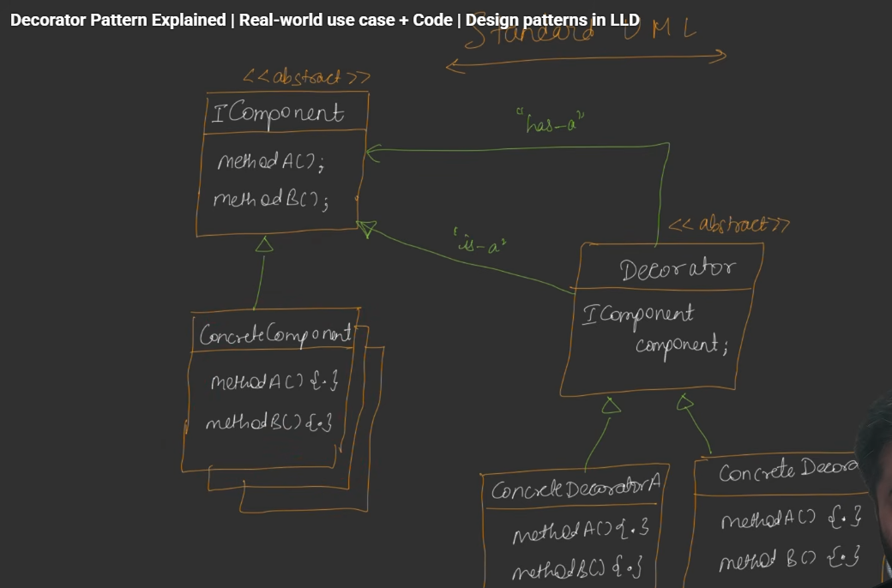

### Decorator pattern
The Decorator Design Pattern is a structural pattern that lets you dynamically add behavior to individual objects without changing other objects of the same class

1. Coffee

*Coffee → Milk → Sugar → Chocolate*

2. Pizza

*Pizza → Cheese → Olives → Jalapeno*

3. Notification

*Email → Logging → Retry → Metrics*

4. I/O Streams

*InputStream → BufferedInputStream → DataInputStream*

The notification and I/O examples are particularly useful because they demonstrate that Decorator isn't just about adding toppings—it is fundamentally about dynamically layering responsibilities around an object.